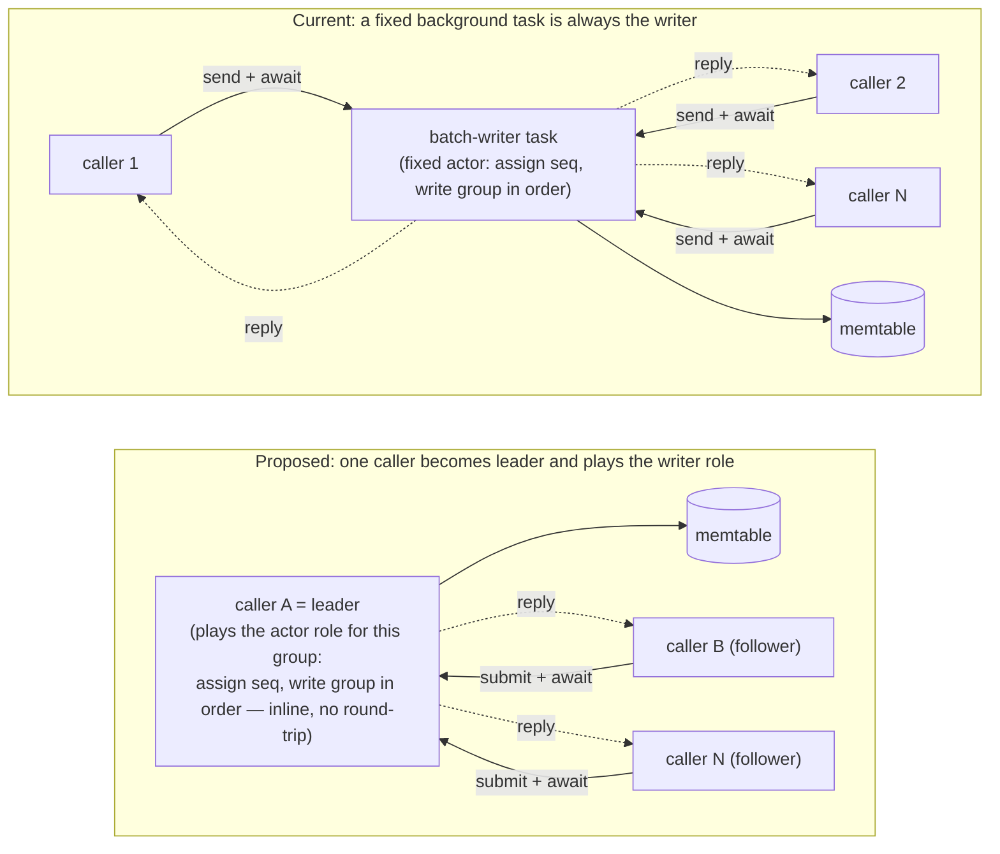

# SlateDB write path: problem and a proposed direction

While validating SlateDB as a Flink state backend we hit a write-heavy case where it was ~5x slower
than RocksDB. This documents one root cause and a proposed direction, each backed by a small
benchmark.

> Flink 1.x reads and writes keyed state from a single thread  
> Flink 2.x async mode writes from a single thread but reads from multiple. Either way, writes are single-threaded and serial.

## The problem: every write pays a cross-thread round-trip

Every write is sent to a single resident batch-writer task and the caller awaits a `oneshot` reply
(`write_notifier.send(..)` + `rx.await`). That task is the sole writer: it assigns the sequence
number and applies the batch to the WAL buffer and memtable on one thread, which keeps ordering
trivial and the write lock off the caller's async context. But it means even a single-threaded
writer must hand each write to another thread and park until it replies — a cross-thread round-trip
per write, when there is no concurrency to protect against.

**Benchmark** (`thread-model-bench`, Criterion, `cargo bench`): a trivial `+1` payload,
single-threaded, comparing a plain call on the calling thread vs sending it to a resident Tokio task
and awaiting its `oneshot` reply (SlateDB's write shape).

| Machine | same thread (`+1`) | cross-thread round-trip |
|---|---|---|
| Apple M-series (arm64) | 1.99 ns · 503 M ops/s | 6.69 µs · 150 k ops/s |
| EC2 x86_64 (Linux) | 2.35 ns · 426 M ops/s | 17.1 µs · 58 k ops/s |

The work is nanoseconds; the round-trip is microseconds — thousands of times more, all OS-level
thread coordination (park/wake, context switches, scheduling). So single-threaded write throughput
is capped at the round-trip rate: ~58k/s on the server, unable to reach 100k/s no matter how fast
the engine is.

## Proposed direction: a leader model

Let the calling thread do the write inline instead of handing it off. Inspired by RocksDB's
group-commit / leader model: the two models are structurally the same (several callers, one
serialized writer, a reply each) — the difference is *who* writes. Today it is a fixed background
task; here **one caller becomes the "leader" for one write group** and writes inline on its own
thread, then hands off. A single writer is always the leader, so it pays no round-trip.

The invariant is preserved — **sequence-number assignment and the memtable write happen as one
ordered step under a single writer at a time**. To avoid starvation, the leader only takes writers
already queued when it starts (a bounded group), then hands off to the next; every write waits at
most one in-flight group plus its own. Durability is unchanged: the leader only appends to the
in-memory WAL buffer, and the background task still flushes to object storage asynchronously.

**Benchmark** (`write-bench`, Criterion, `cargo bench`): single-threaded puts under one aligned
config (100 keys in steady state, WAL disabled, no per-write durability, 60 MiB memtable, local
filesystem). `slatedb_native` = current path; `slatedb_local` = an inline write (`Db::put_local`) as
a POC of the leader fast path; `slatedb_local_cas` = `local` plus one CAS per write, added only in
the benchmark to model the leader's contention check; `rocksdb` = RocksDB's synchronous inline put,
as a reference point.

Each function opens a fresh DB and is fully closed before the next (SlateDB's background tasks would
otherwise skew the following measurement).

| Mode | per put (median ± spread) | throughput (median) | vs `rocksdb` |
|---|---|---|---|
| `rocksdb` (synchronous inline) | 0.90 µs ± 0.01 | 1,110 k ops/s | 1x |
| `slatedb_local_cas` (inline + CAS) | 2.22 µs ± 0.25 | 451 k ops/s | ~2.5x |
| `slatedb_local` (inline, no CAS) | 2.36 µs ± 0.26 | 424 k ops/s | ~2.6x |
| `slatedb_native` (cross-thread round-trip) | 21.82 µs ± 0.07 | 46 k ops/s | ~24x |

EC2 x86_64. Today's cross-thread path is ~24x slower than RocksDB; removing the round-trip (the
inline write) closes most of that gap, to ~2.5x — roughly where a leader fast path would land. The
remaining gap is engine implementation (SlateDB's async write path vs RocksDB's C++ synchronous
one), not the thread model. `local_cas` and `local` overlap within their spread, so acquiring the
writer role costs nothing measurable when uncontended.

> Status: only the uncontended path is implemented — the inline write, plus a CAS in the benchmark
> standing in for acquiring the writer role. The follower queue, group formation and leader handoff
> are not, and the fast path skips the WAL, durability waits and transactions. The concurrent case
> should stay near today's throughput since it keeps one ordered writer, but that is an expectation,
> not a measurement.

> This is an early writeup to start the discussion; if the direction holds up, the design belongs in
> an RFC.
